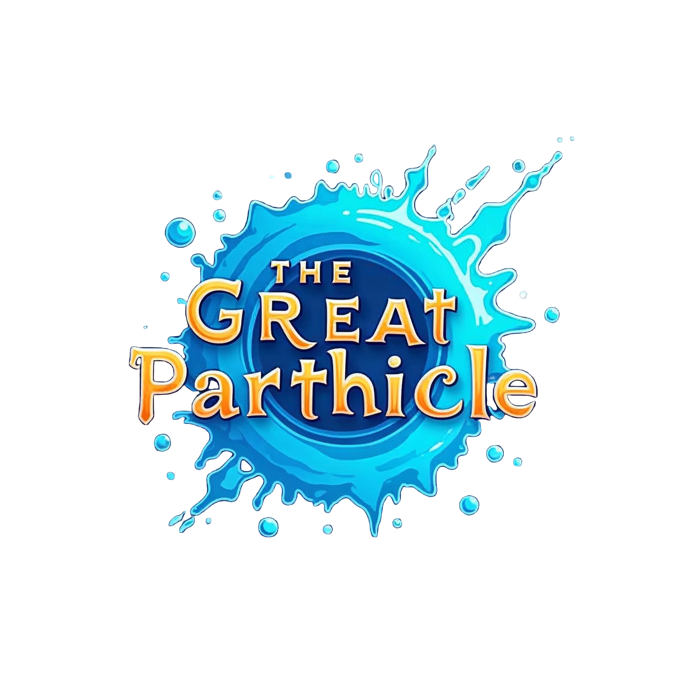
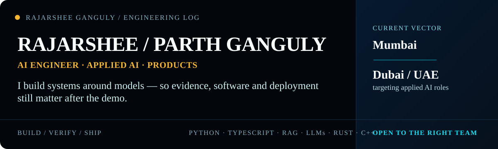
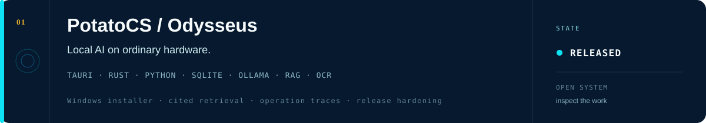
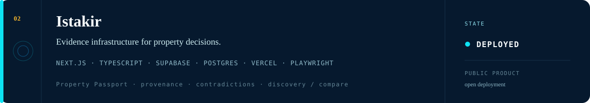
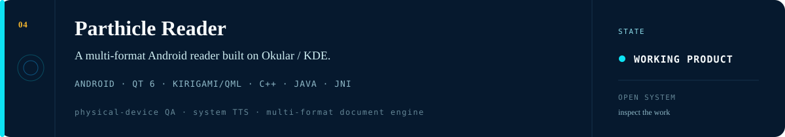
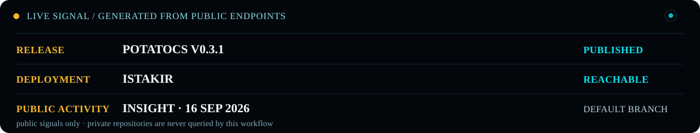

  

  

## Systems in the field

## Live signal

  

Regenerated daily from public GitHub endpoints and the public Istakir deployment. The updater does not query private repositories.

## Engineering range

**AI systems** — RAG · LLM APIs · local inference · OCR · model evaluation  
**Applications** — Python · TypeScript · FastAPI · React / Next.js · REST APIs  
**Systems** — Rust · C++ · Android · SQLite · PostgreSQL  
**Delivery** — Playwright · Cypress · Vitest · GitHub Actions · Vercel

## How I build

**Evidence over model confidence.** Retrieval, extracted claims and AI-assisted inputs stay tied to inspectable evidence or deterministic application state.

**Models propose; software decides.** Probabilistic output sits behind validation, explicit uncertainty and product gates instead of becoming truth by default.

**Ship the whole path.** Desktop, web, Android, backend, databases, tests, release artifacts and deployment all count.

---

**Dubai / UAE opportunities:** Applied AI · AI Engineering · GenAI / LLM · AI Automation · Full-stack AI

[LinkedIn](https://www.linkedin.com/in/rajarsheeganguly/) · [Email](mailto:ribhuganguly96@gmail.com) · [Latest PotatoCS release](https://github.com/parthganguly/PotatoCS/releases/latest)
